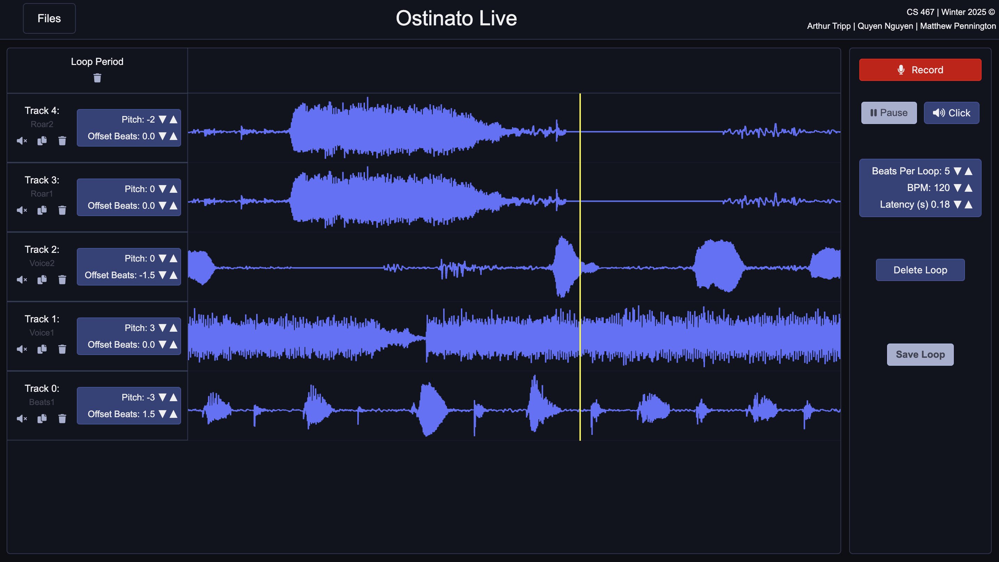
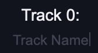
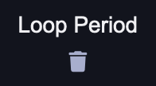
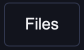
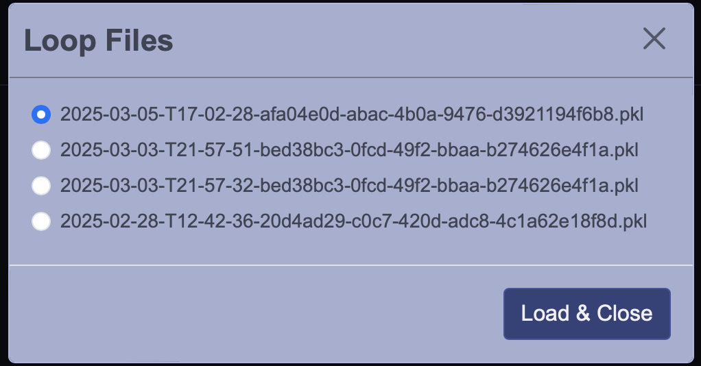

# Ostinato Live - Audio Loop Station
Ostinato Live is an audio looping program that lets musicians create multi-layered live musical performances. By recording short, repeating tracks that can be layered, copied, and modified, a single musician can create a complex musical composition.

Each loop, consisting of an arbitrary number of tracks, can be created and saved during a performance or ahead of time, then loaded for seamless, uninterrupted playback.

The straightforward and intuitive user interface ensures basic functionality can be easily accessed. At the same time, the graphical user interface allows for additional features that are not possible with traditional pedal-based options.



## Installation Guide

**macOS**
1) Create a virtual environment:<br> ```python3 -m venv venv```
2) Activate virtual environment:<br>```source venv/bin/activate```
3) Install dependecies from requirements.txt: <br>```pip3 install -r requirements.txt```
4) Run the app by running: <br>```python3 launch.py```

**Windows**
1) Create a virtual environment:<br> ```python3 -m venv venv```
3) Activate virtual environment:<br>```venv\Scripts\activate```
4) Install dependecies from requirements.txt: <br>```pip3 install -r requirements.txt```
6) Run the app by running: <br>```python3 launch.py```

After running ```python3 launch.py``` in the terminal, the app will automatically launch in an external window, and users do not need to enter a URL as the app will open directly in the WebKit-based window. The app is configured to run on localhost:8050.

## Core Features
- Create a Loop: Set the tempo (bpm) and duration (beats per loop)
- Record a Track: Create unlimited tracks and build a loop with those multi-layered tracks.
    - Seamlessly record tracks during playback.
- Play/Pause: Play or pause playback.
- Track Control: Mute, delete, or duplicate specific tracks during playback.
- Save and Load Loops: Store and access loop files.
- Pitch Shifting: Adjust a track’s pitch up or down to build chords.
- Time Stretching: Adjust tempo without affecting pitch.
- Time Shifting: Move a track forward or backward by the beat.


## Button Functions

### Track-Related Buttons
 **Record**: Record one track audio.
<br> 
 **Track Number and Name:** The track number is displayed above the track name. The default track name is "< Untitled >", which can be renamed by clicking on it and entering a new name.
<br> 
  **Mute/Unmute Track:** Mutes or unmutes the selected track audio. 
<br> 
 **Duplicate Track:** Duplicates the selected track audio.
<br> 
 **Duplicate Track:** Delete the selected track.
<br> 
 **Pitch Changes:** Decrease (down arrow) or increase (up arrow) the track's picth by 1.
<br> 
 **Offset Beats:** Decrease (down arrow) or increase (up arrow) the track's beats by 0.1.


### Loop-Related Buttons 
   **Play/Pause Loop:** Play or Pause the loop
<br>
  **Mute/Unmute Clicks:** Mute or unmute the clicking sounds, which indicates the beats.
<br>
 **Beats Per Loop:** Decrease (down arrow) or increase (up arrow) the beats per loop by 1.
<br>
 **Beats per Minute (BPM)** Decrease (down arrow) or increase (up arrow) the loop bpm by 10.
<br>
 **Latency (s)** Decrease (down arrow) or increase (up arrow) the loop latency by 0.1s.
<br>
  **Delete Loop:** Delete the loop along with all its tracks.
<br>
 **Save Loop:** Save the loop as a .pkl file in the "loops" folder. 
<br>
 **Files:** Opens a files popup displaying a list of .pkl files in the "loops" folder.
<br>
 **Load Loop Files** Loads the selected .pkl loop file into the application and displays the tracks within it.